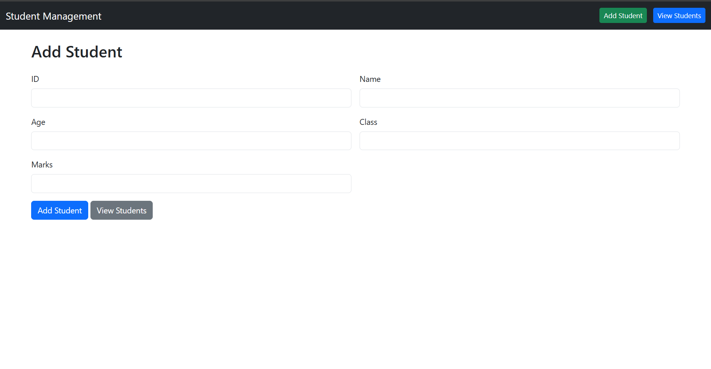
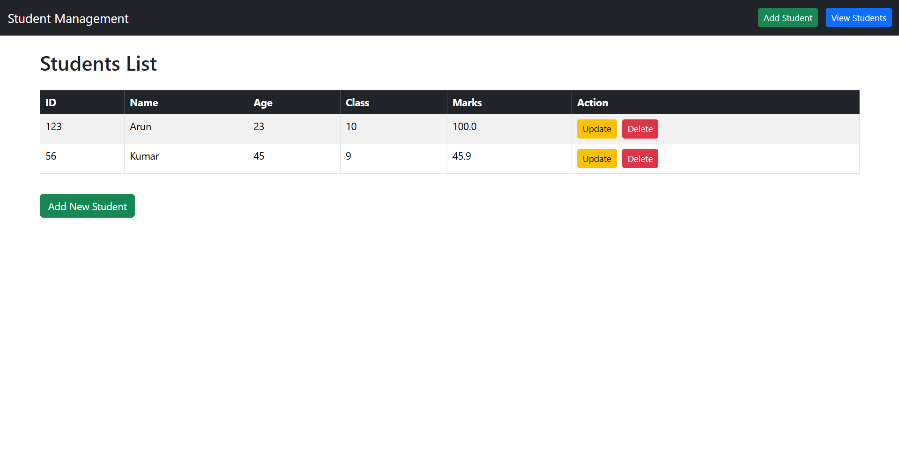

# **Student Management System (Web App)**

## **Overview**

This is a **web-based Student Management System** built using **Core Java, Servlets, JSP, and file storage**.
The app allows you to **add, view, update, and delete students** with **persistent storage** in a file (`students.dat`).

---

## **Key Learning Outcomes**

### **1. Creating a Model**

- Learned to create a **POJO class (`Student.java`)** to represent a student.
- Implemented **`Serializable`** to allow objects to be saved to a file.
- Added **getters, setters, and `toString()`** methods to access and display data.

---

### **2. Reading and Writing Data to a File**

- Learned how to **save Java objects to a file** using `ObjectOutputStream`.
- Learned how to **read objects back** using `ObjectInputStream`.

---

### **3. Using Servlets**

- Learned how to create **Servlets** for handling web requests:

  - `AddStudentServlet.java` → Add new student
  - `UpdateStudentServlet.java` → Update student details
  - `DeleteStudentServlet.java` → Delete student

- Learned to use:

  - **`HttpServletRequest`** → to get form data (`request.getParameter()`)
  - **`HttpServletResponse`** → to send redirects (`response.sendRedirect()`)

---

### **4. Writing HTML in JSP/Servlet Pages**

- Learned to **write HTML in JSP pages** while embedding Java code.
- Used **JSP script** to display student data dynamically in tables.

---

### **5. Displaying Output**

- Learned to **show data in HTML tables** dynamically.
- Learned to include **links for Update/Delete operations**.
- Example output in the browser:

#### **Add Student Page**



#### **View Students Page**



---

## **Project Structure**

```
StudentManagementWeb/
│
├─ src/
│   ├─ model/          → Student.java, StudentRepository.java
│   ├─ servlet/        → AddStudentServlet.java, UpdateStudentServlet.java, DeleteStudentServlet.java
│
├─ WebContent/         → JSP pages (addStudent.jsp, viewStudents.jsp, updateStudent.jsp)
├─ WEB-INF/            → web.xml, classes, lib
└─ students.dat        → Stores student data
```

---

## **Skills Gained**

- Core Java: classes, objects, serialization
- File I/O: read/write objects
- Servlets: handling requests and responses
- JSP: dynamic HTML with Java
- Basic web app workflow: user input → process → output

---

## **How to Run**

1. Install **Apache Tomcat**.

2. Run on **Tomcat server**.

3. Compile the java files. 

4. Add the WEB_INF(folder),student.dat,jsp files inside the WebContent folder inside the webpages located in the tomcat.

5. Inside tomcat/bin start the server and visit the port showen in the command prompt.
